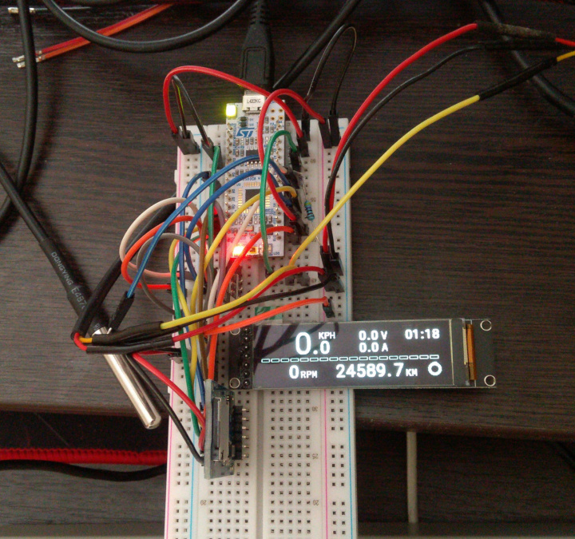

# eDashbox
E-bike dashboard and datalogger, opensource.
Firmware for STM32-Nucleo32L4 board.

This is STM32 learning project in early stage, use it at your own risk.



## Build
Note: Development is in 'master' branch, don't be surprised for a lot of compilation errors.

### Prerequisities
* Linux
* tup build system
* Nim language compiler
* GIMP
* ImageMagick
* STM32 CubeMX (optional)
* SEGGER JLink debugger and software (optional, for debug only)
* Microsoft VS code (optional)

### Process
* First time build after 'git clone' or after CubeMX code generation run:
```
$ Tools/configure.sh
$ tup
```

* Regular builds - just run:
```
$ tup
```


## Debug
* JLink debugger setup for VSCode <https://wiki.segger.com/J-Link_Visual_Studio_Code>


## IDE
VS code - it is fast and stable, especially with debugging.
Fix not found includes in VS code:
<https://stackoverflow.com/questions/37522462/visual-studio-code-includepath>


## Hardware
### STM32 Nucleo-32 board (STM32L432KC)

### DS18B20 temperature sensor
* Use 4.7 kOhm resistor from Vdd to Data pin, accordig to specs
* Tested with 3.3V Vdd

### SH1122 2.08" 256x64 16 colors OLED Display
<https://www.aliexpress.com/item/4000866935030.html>


## Credits
* Tiny printf() for embedded systems:
<https://github.com/mpaland/printf>

* SH1122 OLED Display HAL driver:
<https://github.com/mikhail-tsaryov/SH1122-STM32-HAL-Driver>

* DS18B20 temperature sensor onewire HAL driver:
<https://github.com/lamik/DS18B20_STM32_HAL>

* SPI MicroSD FatFs code:
<https://github.com/eziya/STM32_SPI_SDCARD>

* Tup build system:
<http://gittup.org/tup/manual.html>


## TODO
* Change IDE to Vim, configure debugging
* Test FatFs for MicroSD formatted with mkfs.vfat
* GPS
* current/voltage sensor
